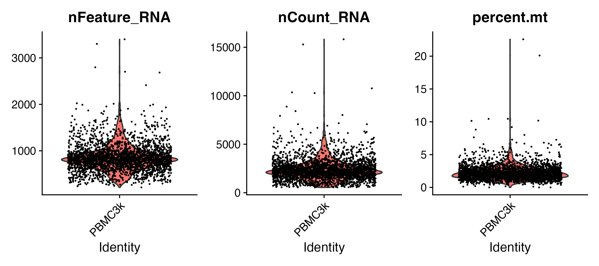
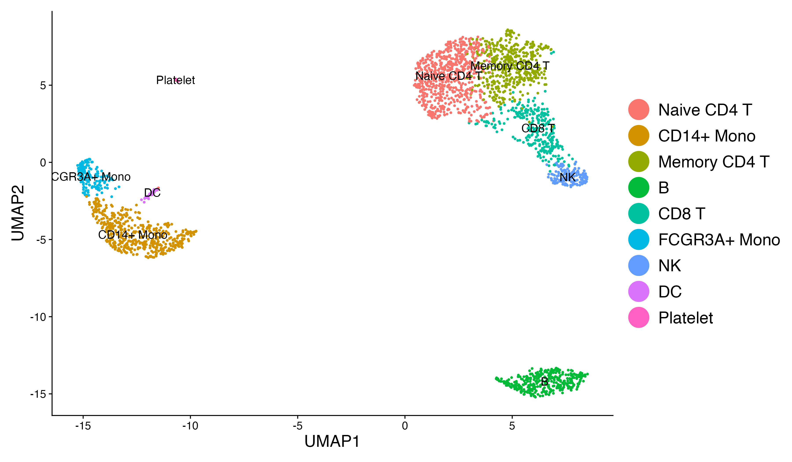

# PBMC 3K scRNA-seq Analysis using Seurat

**Author:** Muhammad Abrar

A reproducible single-cell RNA sequencing (scRNA-seq) analysis of the 10x Genomics PBMC 3K dataset using the Seurat R package.

This project was developed as part of my bioinformatics portfolio to strengthen practical skills in single-cell transcriptomics, reproducible data analysis, and version control with Git and GitHub.

---

## Overview

This workflow follows the standard Seurat analysis pipeline and includes:

- Data import
- Quality control (QC)
- Data normalization
- Identification of highly variable genes
- Data scaling
- Principal component analysis (PCA)
- Graph-based clustering
- UMAP visualization
- Differential expression analysis
- Cell-type annotation using canonical marker genes

---

## Dataset

- **Dataset:** 10x Genomics PBMC 3K
- **Source:** 10x Genomics
- **Analysis framework:** Seurat (R)

The raw count matrix included in this repository is the publicly available 10x Genomics PBMC 3K dataset used in the official Seurat tutorials.

---

## Repository structure

```
PBMC_scRNAseq/
├── data/
│   └── filtered_gene_bc_matrices/
├── output/
│   └── figures/
│       ├── qc_violin.png
│       ├── elbow_plot.png
│       └── pbmc_umap.png
├── scripts/
│   └── PBMC_scRNAseq_analysis.R
├── PBMC_scRNAseq.Rproj
└── README.md
```

---

## Analysis workflow

1. Load Cell Ranger count matrix
2. Create Seurat object
3. Perform quality control
4. Normalize expression data
5. Identify highly variable genes
6. Scale gene expression
7. Run principal component analysis (PCA)
8. Construct nearest-neighbour graph
9. Cluster cells
10. Generate UMAP embedding
11. Identify cluster marker genes
12. Annotate cell types

---

## Output figures

### Quality control



### PCA elbow plot


### UMAP



---

## Requirements

This project was developed in R using the following packages:

- Seurat
- dplyr
- ggplot2
- patchwork

---

## Running the analysis

Open the RStudio project:

```
PBMC_scRNAseq.Rproj
```

Then run:

```r
source("scripts/PBMC_scRNAseq_analysis.R")
```

The script reproduces the complete analysis workflow and saves the generated figures in `output/figures/`.

---

## Acknowledgements

This project uses the publicly available PBMC 3K dataset and follows the analysis workflow presented in the official Seurat guided tutorial developed by the Satija Lab.

The code has been adapted, documented, and organized as part of my personal bioinformatics learning portfolio.